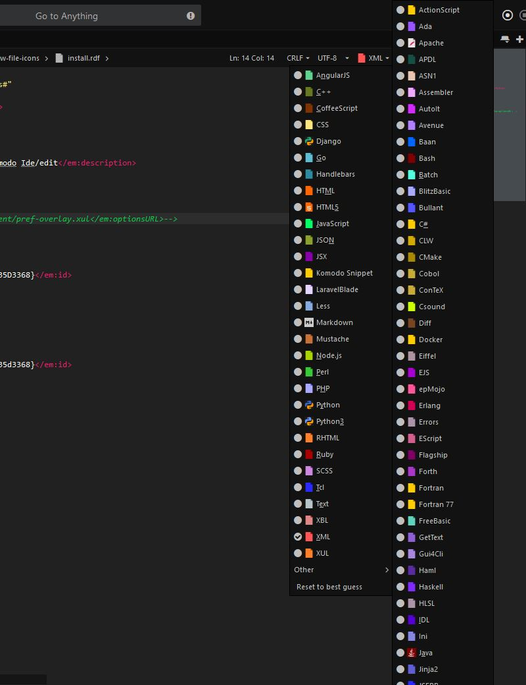

# New File type Icons

Replace you're default file type icons, with these new icons.  
Designed to give you more contrast between you're open files.

## How to install

Install trough Komodo.

You can install the New File Icons trough the Tools menu.  
**Tools > New File Icons > Install New File Icons**  
**Note:** You need to run Komodo as adminitrator (because the addon needs to make changes in the install directory).  

## How to get the old icons back?
You need to uninstall Komodo and Reinstall Komodo to get the old icons back.  
**Note:** Reinstalling Komodo will preserve you're settings, the are stored in a separate profile folder.
