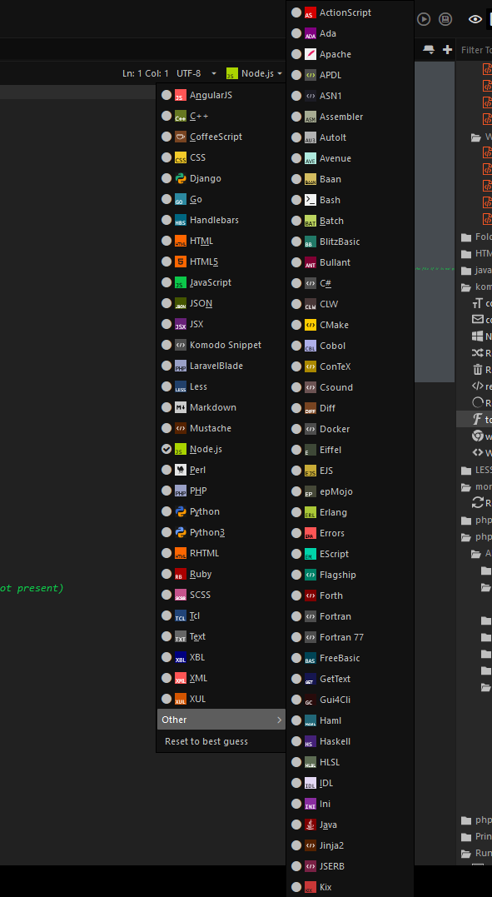

# New File type Icons

Replace you're default file type icons, with these new icons.  
Designed to give you more contrast between you're open files.



## How to install

To install the the new file icons you will have to replace the default icons in you're install folder.

**Note: before replacing the icons, make a back up so you can switch back at any time.**
```
// Windows
C:\Program Files (x86)\ActiveState Komodo [IDE|Edit] 11\lib\mozilla\chrome\icons\default\fileicons
// Linux
/opt/Komodo-[IDE|Edit]-<version>/lib/mozilla/chrome/icons/default/fileicons
// Mac os
/Applications/Komodo-[IDE|Edit]-<version>.app/lib/mozilla/chrome/icons/default/fileicons
```

You then have to remove the already generated icons, you will find in you're profile folder.
```
// Windows
C:\Users\<username>\AppData\Local\ActiveState\Komodo[IDE|Edit]\11.0\XRE\icons\fileicons
// Linux
/home/<username>/.komodo[ide|edit]/11.0/XRE/icons/fileicons
// Mac os
/Users/<username>/Library/Application Support/Komodo[IDE|Edit]/11.0/XRE/icons/fileicons
```

(Re)start Komodo and you're done.
